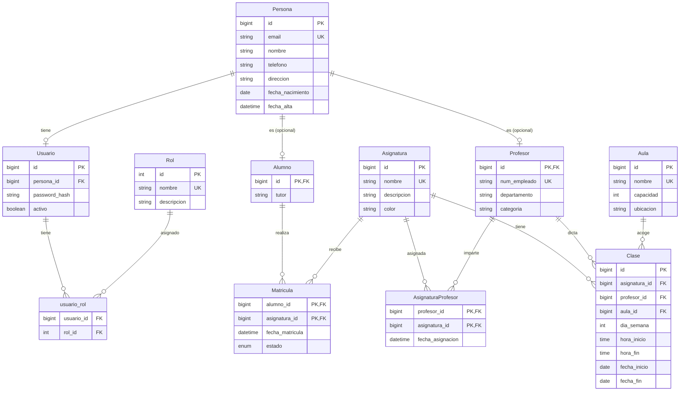

# Modelo de Datos

## Diagrama Entidad-Relación (Mermaid)

## Descripción de Entidades

- **Persona**: Datos comunes de cualquier persona (alumnos, profesores, administradores). Su `id` es la clave primaria. El `email` es único.
- **Usuario**: Cuenta de acceso asociada a una persona. Contiene la contraseña cifrada y el estado (activo/inactivo).
- **Rol**: Roles del sistema (`admin`, `profesor`, `alumno`). Relación muchos a muchos con `Usuario` a través de `usuario_rol`.
- **Alumno**: Extiende a `Persona` (clave primaria igual al `id` de persona). Añade atributos específicos como `tutor`.
- **Profesor**: Extiende a `Persona` con atributos profesionales (`num_empleado`, `departamento`, `categoria`).
- **Asignatura**: Materias ofrecidas por la academia. `nombre` único.
- **Aula**: Espacios físicos. `nombre` único.
- **Clase**: Sesión periódica de una asignatura en un día y horario fijos, impartida por un profesor y opcionalmente en un aula.
- **Matricula**: Inscripción de un alumno en una asignatura. Clave compuesta por `alumno_id` y `asignatura_id`. Incluye fecha y estado.
- **AsignaturaProfesor**: Asignación de un profesor a una asignatura (relación muchos a muchos con atributo `fecha_asignacion`).

## Notas sobre el modelo

- Se ha optado por **composición en lugar de herencia** para `Alumno` y `Profesor`: ambas tablas tienen una clave primaria que a la vez es clave foránea a `Persona`. Esto permite que una persona pueda ser simultáneamente alumno y profesor.
- Las tablas `Matricula` y `AsignaturaProfesor` usan **claves compuestas** para reflejar correctamente las relaciones muchos a muchos con atributos adicionales.
- La tabla `Clase` permite que `aula_id` sea nulo (clase online o sin aula fija). Las restricciones de unicidad de horario para profesor y aula se implementan a nivel de aplicación (servicio), no en la base de datos.
